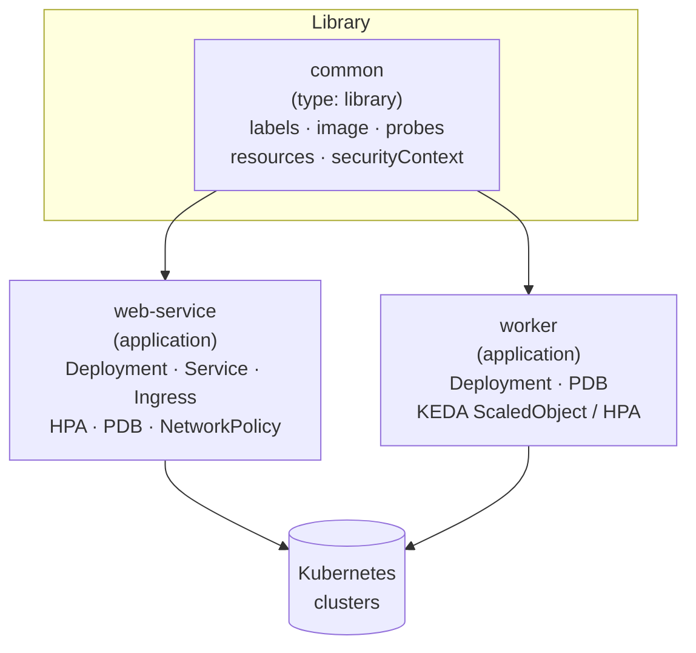
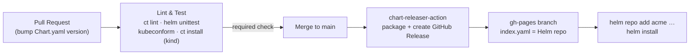

# helm-charts-library

[](https://helm.sh)
[](https://kubernetes.io)
[](./LICENSE)
[](https://github.com/acme/helm-charts-library/actions/workflows/lint-test.yml)
[](https://github.com/acme/helm-charts-library/actions/workflows/release.yml)

> A reusable Helm chart library for a platform team — a shared **library chart**
> of templated helpers, two opinionated **application charts** built on top of it,
> and a fully automated lint → test → release pipeline that publishes a versioned
> Helm repository to GitHub Pages.

## Architecture



### Release flow



## ✨ Features

- **Library chart for DRY templating** — `common` centralizes labels, fullname,
  image strings, probes, resources and hardened security contexts. App charts
  `include` them instead of copy-pasting `_helpers.tpl` into every service.
- **Schema-validated inputs** — each application chart ships a
  `values.schema.json`, so bad values fail fast at `helm install`/`lint` time.
- **Automated SemVer releases** — `helm/chart-releaser-action` packages charts
  and publishes them to a GitHub Pages Helm repo; only versions not yet released
  are published.
- **CI lint & test gate** — `ct lint`, `helm unittest`, `kubeconform` manifest
  validation, and a real `ct install` against an ephemeral `kind` cluster, all
  required before merge.
- **Hardened defaults** — non-root, read-only root filesystem, dropped
  capabilities, `RuntimeDefault` seccomp, PDBs and autoscaling out of the box.

## 📦 Charts

| Chart | Type | Purpose | Key resources |
| ----- | ---- | ------- | ------------- |
| [`common`](./charts/common) | library | Shared named-template helpers reused by every app chart. | _(renders nothing)_ |
| [`web-service`](./charts/web-service) | application | Stateless HTTP microservice. | Deployment, Service, Ingress, HPA, PDB, ConfigMap, NetworkPolicy, ExternalSecret |
| [`worker`](./charts/worker) | application | Queue / async worker. | Deployment, PDB, KEDA ScaledObject (or custom-metric HPA) |

## 🚀 Usage

Add the published repository and install a chart:

```bash
helm repo add acme https://acme.github.io/helm-charts-library
helm repo update

# A web service
helm install my-web acme/web-service \
  --set image.repository=ghcr.io/acme/web \
  --set image.tag=1.4.2 \
  --set ingress.enabled=true \
  --set ingress.hosts[0].host=web.example.com

# A queue worker (scales to zero with KEDA)
helm install ingest acme/worker \
  --set image.repository=ghcr.io/acme/worker \
  --set image.tag=2.0.1 \
  --set env.QUEUE_NAME=ingest
```

Or develop locally from this repo:

```bash
make deps       # pull the common library into the app charts
make lint test  # ct lint + helm unittest
make template   # render manifests
```

## 🔁 Release Process

1. Open a PR that bumps the `version:` in the affected chart's `Chart.yaml`
   (SemVer). Changing `common` is high-blast-radius and is gated by `CODEOWNERS`.
2. The **Lint & Test** workflow runs on the PR and is a required status check:
   `ct lint`, `helm unittest`, `kubeconform`, and `ct install` on a `kind`
   cluster for any changed chart.
3. On merge to `main`, the **Release** workflow runs
   `helm/chart-releaser-action`, which packages each chart, creates a GitHub
   Release with the `.tgz` asset, and updates `index.yaml` on the `gh-pages`
   branch — turning the repo into a consumable Helm repository.
4. Already-released versions are skipped, so unrelated merges don't re-publish.

## 🧭 Engineering Case Study

**Problem.** A platform team supporting many microservices across multiple
clusters found that every service carried its own hand-rolled Helm chart. The
`_helpers.tpl`, label conventions, probe wiring and security contexts had quietly
diverged — so a hardening change (say, enforcing read-only root filesystems) meant
editing dozens of near-identical charts, and "near-identical" hid real drift.

**Approach.** Packaging was split into a shared `common` **library chart** and a
small set of **application charts** (`web-service`, `worker`) that consume it.
The library owns the cross-cutting templates exactly once; the app charts own
only what is genuinely service-shaped (a Service + Ingress for HTTP, a KEDA
ScaledObject for a queue worker). Inputs are constrained with
`values.schema.json` so misconfiguration fails at lint time rather than in a
cluster, and a CI gate (`ct` + `helm unittest` + `kubeconform` + a real `kind`
install) runs before anything merges. Releases are automated with
chart-releaser, giving every consumer immutable, SemVer-pinned chart versions
from a single Helm repo.

**Outcome.** New services start from a vetted chart instead of a copy-paste, a
single library bump rolls a policy change out everywhere, and the gap between
"what the chart says" and "what's running" closes — boilerplate and drift both
go down while review focuses on the parts that actually differ.

_This case study is a generalized account of the pattern; it names no employer,
client, or proprietary system._

## 📄 License

[MIT](./LICENSE) © Muhammad Imad
